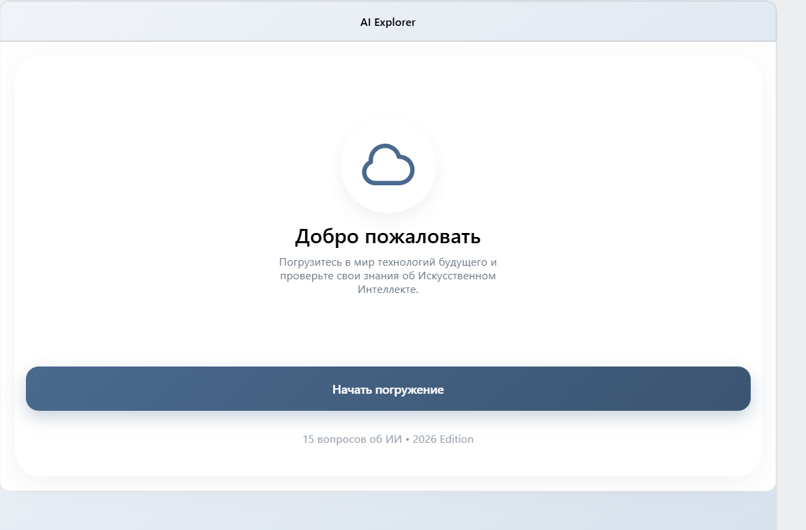
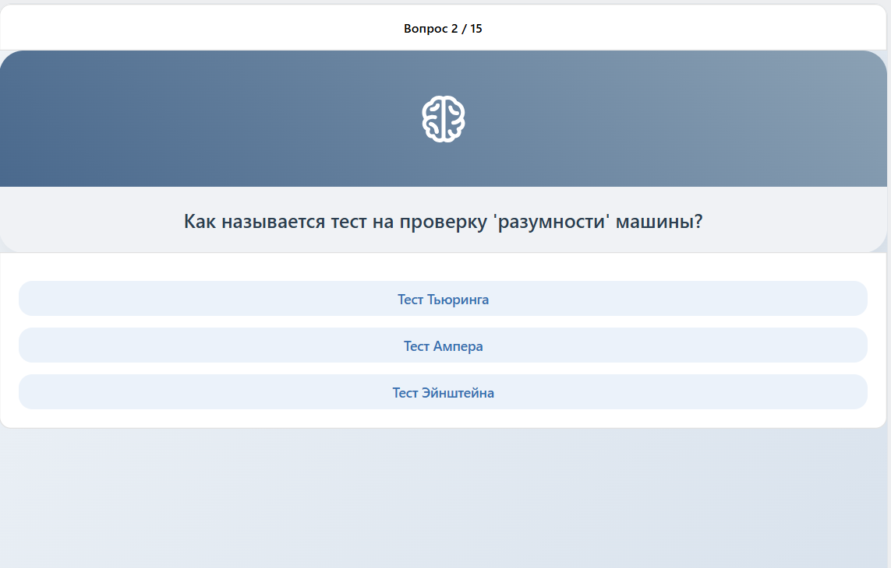

# Basic [VK Bridge](https://github.com/VKCOM/vk-bridge) + [VKUI](https://github.com/VKCOM/VKUI) + [VK Miniapps Router](https://github.com/VKCOM/vk-mini-apps-router) app

Этот шаблон предоставляет базовый код и настройки для создания мини-приложения внутри ВКонтакте.  
В качестве сборщика проекта выступает [Vite](https://vite-docs-ru.vercel.app/guide/), подробнее про его конфигурацию и дополнительные плагины можно прочитать [здесь](https://vite-docs-ru.vercel.app/config/) и [здесь]().

# AI Explorer — VK Mini App 🚀

Интерактивная викторина об искусственном интеллекте, созданная на базе **React**, **VKUI** и **VK Bridge** в рамках производственной практики.

## 📱 Скриншоты интерфейса



## 🛠 Технический стек
* **Framework:** React 18
* **UI Библиотека:** VKUI (дизайн-система ВКонтакте)
* **Интеграция:** VK Bridge (API для мини-приложений)
* **Хостинг:** GitHub Pages

## 🚀 Быстрый запуск (Локально)

1. **Клонируйте репозиторий:**
   ```bash
   git clone [https://github.com/polinaberkyt-jpg/vkqviz.git](https://github.com/polinaberkyt-jpg/vkqviz.git)
